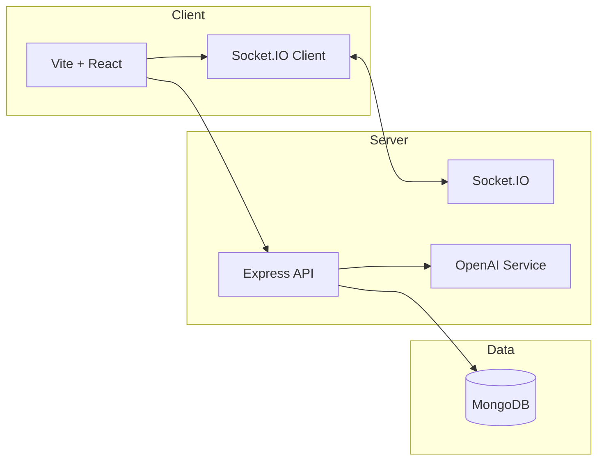
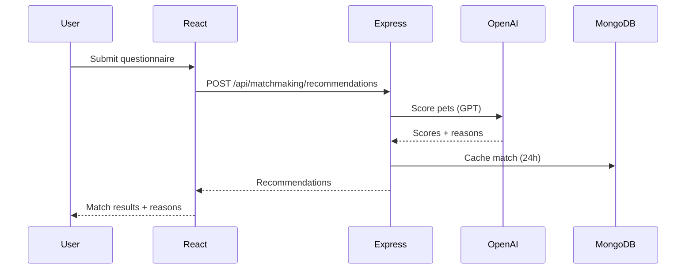
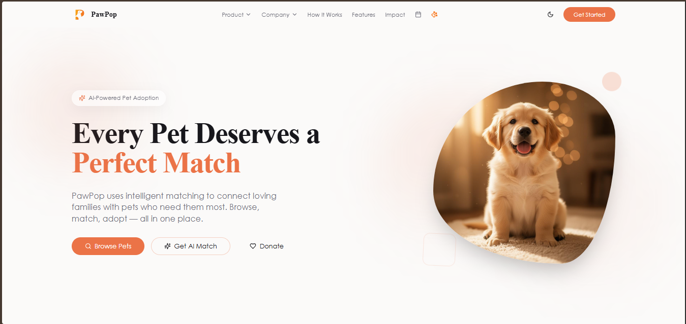
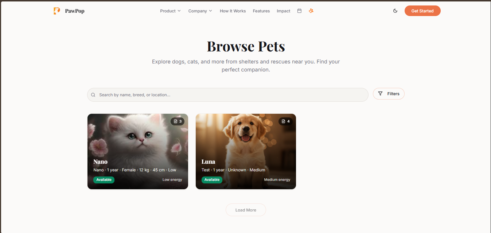
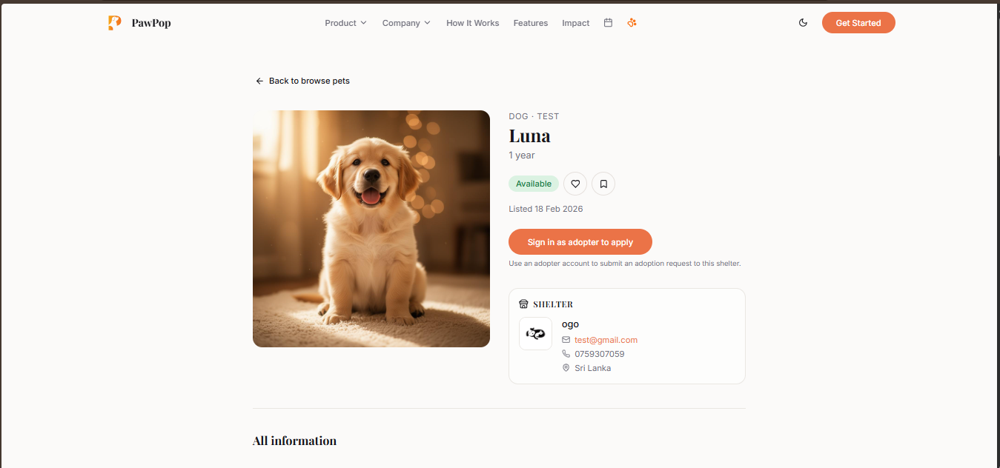
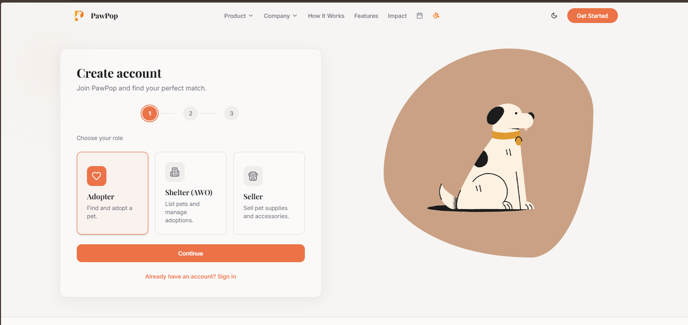
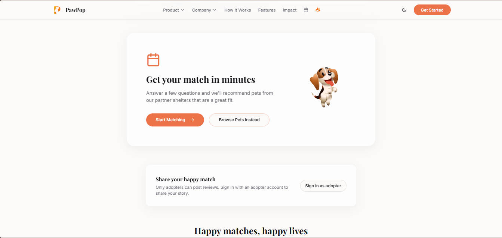

<p align="center">
  
</p>

<h1 align="center">🐾 PawPop</h1>
<p align="center">
  <strong>Find your perfect match. Adopt with confidence.</strong>
</p>
<p align="center">
  A full-stack pet adoption platform with <strong>AI-powered matching</strong>, shelter & seller dashboards, <strong>real-time updates</strong> (WebSockets), and fundraising — built for adopters, shelters (AWOs), and pet stores.
</p>

---

## 🏷 Technology badges

| Category | Badges |
|----------|--------|
| **Frontend** |       |
| **UI & Forms** |       |
| **Real-time & API** |     |
| **Backend** |     |
| **Auth & Security** |   |
| **Dev & Test** |    |

---

## 📑 Table of contents

| Section | Description |
|---------|-------------|
| [🎬 Demo](#-demo) | Walkthrough video |
| [✨ Features](#-features) | By role & platform capabilities |
| [🛠 Full tech stack](#-full-tech-stack) | All technologies used (frontend, backend, dev) |
| [🏗 Architecture](#-architecture) | Diagrams & data flow |
| [🚀 Quick start](#-quick-start) | Clone, env, run |
| [📁 Project structure](#-project-structure) | Folder layout |
| [⏯ Interactive sections](#-interactive-sections) | Expandable env, scripts, API |
| [📄 License](#-license) | Terms |

---

<br />

## 🎬 Demo

Watch a quick walkthrough of PawPop — browse pets, AI matching, adoption flow, and dashboards.


---

<br />

## ✨ Features

| Role | Highlights |
|------|------------|
| **🐕 Adopters** | Browse pets, AI matching questionnaire, match score on pet cards & detail, adoption requests, wishlist, saved pets, pet store shopping, fundraising donations |
| **🏠 Shelters (AWO)** | Dashboard, pet listings, adoption requests with match scores, events, fundraising campaigns, donations, real-time notifications, profile & verification |
| **🛒 Sellers** | Product catalog, orders, inventory, earnings, payouts, notifications |
| **👑 Admin** | User/shelter/seller management (block/unblock, approve), pets & adoptions, donations, fundraising approval, events, analytics, **OpenAI integration**, health & logs |

### 🎯 Platform capabilities

- **AI Pet Matching** — Questionnaire (lifestyle, energy, kids, care) + optional free-text; **OpenAI (GPT)** scores each pet and returns reasons. Match cache (24h) for browse & pet detail.
- **Real-time** — **Socket.IO** (WebSockets) for adoption requests, user status, pets, events, fundraising, notifications.
- **Adoption pipeline** — Request → shelter review → interview → approve/reject; match score and reasons stored with each request.
- **Fundraising** — Campaigns, donations, admin approval, shelter payouts.
- **Pet store** — Products, cart, checkout (seller flow separate from adoption).

---

<br />

## 🛠 Full tech stack

### Frontend

| Technology | Purpose |
|------------|--------|
| **React 18** | UI library |
| **TypeScript** | Type safety |
| **Vite** | Build tool & dev server |
| **React Router DOM** | Client-side routing |
| **Tailwind CSS** | Utility-first CSS |
| **Radix UI** | Accessible primitives (accordion, dialog, dropdown, tabs, toast, etc.) |
| **shadcn/ui** | Component set (Button, Card, Form, Table, etc.) |
| **React Hook Form** | Form state & validation |
| **Zod** | Schema validation (with `@hookform/resolvers`) |
| **TanStack Query** | Server state, caching, refetch |
| **Socket.IO Client** | Real-time updates (WebSockets under the hood) |
| **Recharts** | Charts (admin/shelter analytics) |
| **Lucide React** | Icons |
| **date-fns** | Date formatting |
| **react-day-picker** | Date picker components |
| **jsPDF** + **jspdf-autotable** | PDF export (reports, receipts) |
| **Sonner** | Toast notifications |
| **next-themes** | Theme (light/dark) |
| **cmdk** | Command palette |
| **Vaul** | Drawer component |
| **Embla Carousel** | Carousels |
| **input-otp** | OTP input |

### Backend

| Technology | Purpose |
|------------|--------|
| **Node.js** | Runtime |
| **Express** | REST API server |
| **MongoDB** | Database (Atlas or local) |
| **Mongoose** | ODM (models, schemas) |
| **Socket.IO** | Real-time server (WebSockets + fallbacks) |
| **OpenAI API** | AI matchmaking (GPT-4o-mini or configurable model); **ChatGPT-compatible** |
| **jsonwebtoken (JWT)** | Auth tokens |
| **bcryptjs** | Password hashing |
| **Multer** | File uploads (images, documents) |
| **cors** | Cross-origin requests |
| **dotenv** | Environment variables |

### Development & testing

| Technology | Purpose |
|------------|--------|
| **ESLint** | Linting |
| **Vitest** | Unit/integration tests |
| **@testing-library/react** | Component testing |
| **jsdom** | DOM environment for tests |
| **TypeScript** | Types (frontend + server types) |

---

<br />

## 🏗 Architecture



- **Frontend** talks to **Express** (REST) and **Socket.IO** (real-time/WebSockets). **Matchmaking** uses **OpenAI** (optional) for compatibility scoring; data stored in **MongoDB**.

### Data flow (AI matching)



---

<br />

## 🚀 Quick start

### Prerequisites

- **Node.js** 18+
- **MongoDB** (local or [MongoDB Atlas](https://www.mongodb.com/cloud/atlas))
- **npm** or **yarn**

### 1. Clone & install

```bash
git clone https://github.com/your-username/pawpop.git
cd pawpop
npm install
npm run server:install
```

### 2. Environment

Create a `.env` in the project root (see [Environment](#-environment) below for the full list):

```env
# Required for frontend → API
VITE_API_URL=http://localhost:3001

# Required for backend (MongoDB)
MONGODB_USER=your_user
MONGODB_PASSWORD=your_password
MONGODB_HOST=your_cluster.mongodb.net
MONGODB_DATABASE=pawpop

# Optional: auth & OpenAI (server)
# JWT_SECRET=your-jwt-secret
# OPENAI_KEY_ENC_SECRET=your-openai-encryption-key
```

### 3. Run

**Terminal 1 — Backend (API + Socket.IO):**

```bash
npm run server
```

**Terminal 2 — Frontend:**

```bash
npm run dev
```

- Frontend: **http://localhost:5173** (or Vite’s port)  
- API: **http://localhost:3001**

### 4. First admin user

```bash
node server/scripts/promote-admin.js
# Default: admin@gmail.com / admin@123
```

Sign in at `/auth/signin` and you’ll be redirected to the admin dashboard.

---

<br />

## 📁 Project structure

```
pawpop/
├── src/                    # Frontend (Vite + React)
│   ├── components/         # UI (shadcn, match, shelter, admin)
│   ├── contexts/           # Shelter, Cart, Auth, etc.
│   ├── data/               # Mock / static data
│   ├── lib/                # API clients, auth, socket, match cache
│   ├── pages/              # Routes (auth, dashboards, match, pet, fundraising)
│   └── types/              # TypeScript types
├── server/                 # Backend (Express)
│   ├── middleware/         # Auth (requireAuth, requireAdmin, etc.)
│   ├── models/             # Mongoose (User, Pet, AdoptionRequest, etc.)
│   ├── routes/             # API (auth, admin, shelter, matchmaking, etc.)
│   ├── services/           # OpenAI, matchmaking
│   ├── scripts/            # promote-admin, promote-shelter
│   └── utils/              # Encryption (API key)
├── .env                    # Local env (do not commit secrets)
├── package.json            # Frontend scripts & deps
└── README.md
```

---

<br />

## ⏯ Interactive sections

<details>
<summary><strong>📋 Environment variables</strong></summary>

| Variable | Where | Description |
|----------|--------|-------------|
| `VITE_API_URL` | Frontend | Backend base URL (e.g. `http://localhost:3001`) |
| `MONGODB_USER` | Server | MongoDB Atlas user |
| `MONGODB_PASSWORD` | Server | MongoDB Atlas password |
| `MONGODB_HOST` | Server | MongoDB Atlas host (e.g. `cluster.xxxxx.mongodb.net`) |
| `MONGODB_DATABASE` | Server | Database name (default `pawpop`) |
| `JWT_SECRET` | Server | Secret for JWT signing (optional in dev) |
| `OPENAI_KEY_ENC_SECRET` | Server | Key for encrypting stored OpenAI API key (optional) |

</details>

<details>
<summary><strong>📜 NPM scripts</strong></summary>

| Command | Description |
|---------|-------------|
| `npm run dev` | Start Vite dev server (frontend) |
| `npm run build` | Production build (frontend) |
| `npm run server` | Start Express + Socket.IO (backend) |
| `npm run server:install` | Install backend dependencies |
| `npm run preview` | Preview production build |
| `npm run lint` | Run ESLint |
| `npm run test` | Run Vitest |

**Backend (from `server/`):**

- `node scripts/promote-admin.js [email] [password]` — Create/update admin user.
- `node scripts/promote-shelter.js <email>` — Set user role to `shelter` (and active).

</details>

<details>
<summary><strong>🔌 API & real-time (Socket.IO events)</strong></summary>

- **REST** — Auth (`/api/auth`), users, pets, adoption requests, shelter, admin, matchmaking, fundraising, events, etc.
- **Socket.IO** (WebSockets) — Events: `user:status-changed`, `user:password-reset`, `user:deleted`, `adoption-requests:changed`, `pets:changed`, `events:changed`, `fundraising:changed`, `notifications:changed`, `categories:changed`, `products:changed`, and more. Used for live updates on dashboards and lists.

</details>

---

<br />

## 📸 Screenshots

| | |
|---|---|
|  |  |
| *s1* | *s2* |
|  |  |
| *s3* | *s4* |
|  | |
| *s5* | |

---

<br />

## 📄 License

This project is private/unlicensed. Use and distribution subject to the repository owner’s terms.

---

<p align="center">
  <strong>🐾 PawPop</strong> — Built for adopters, shelters, and pets.
</p>
<p align="center">
  <sub>If you use this project, consider giving it a ⭐ on GitHub.</sub>
</p>
